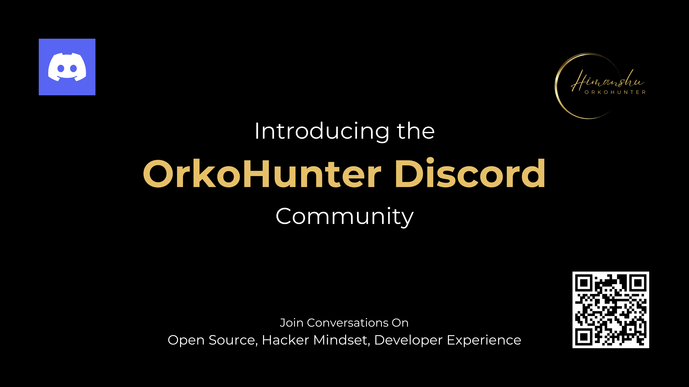

10 years ago, I arrived as a naive fresher in my engineering college. And like many, my first year was pretty bad in terms of both social and academic growth. I made very little effort to make new friends, skipped most classes, scored 7 point something CGPA and had no idea what I was going to do in life.

Although I had prior understanding of programming, my first hands-on keyboard experience was my Data Structures and Algorithms course. Those juicy Sun Microsystems computers and fully air conditioned labs used to put me to sleep after lunch. I was a slow learner in that class. I was started struggling a lot when the time came to implement linked lists or perform string manipulations in character arrays. Segmentation Fault used to be the highlight of most days.

Somehow, I managed to pass all the exams and started doing all the random things college freshers do in India - soldering thin wires on an iron plate, mistaking flasks for bowls in chemistry labs while wearing thick white coats and shovelling soil. We all have done it all.

Second semester started and something was missing. Not that long ago, I had cracked IIT JEE, what is supposed to be country's most difficult engineering exam which everyone writes. Millions. And I was top 2000 in the country. Not too bad, eh? And here I was, clueless about life. And it was not just me, others were clueless just like me.

This is when my _bhaiya_ told me about Open Source and Google Summer of Code. _"Create a GitHub profile and start contributing to previous GSoC projects"_ he said. The horrors of implementing a linked list in C were fresh in my mind. I started learning Python. I remember a phone call when I said - _"it just feels like a wrapper which is easy to understand, but isn't this just cheating? I don't understand C. I don't know programming"_. I was doing everything possible to sabotage my self-esteem and tell myself that I'm a failure and can't write code.

The night GSoC results came out, I changed. It felt like Open Source will resurrect my joy and meaning in life.

---

What you have just read involves a lot of luck but also persistence. And still, only 0.01% make it this far with this speed. Think about all the students who didn't get proper coaching to study for IIT JEE. All the students in Tier 2, Tier 3 colleges who thought they can get good jobs just by attending classes and doing well in exams.

Our country is training students to pass exams and not really to get real world experience or acquire knowledge. This is no surprise, we've known this for a while. However, now I feel nothing will change if we keep ranting and not do anything about it.

While we're just thinking about all of this, there are "influencers" with millions of followers on YouTube and Instagram, telling batshit crazy things to students. With no professional experience, they are preparing an army of next generation of students in India - all driven by fear and fandom. This all came to light with the biggest fuck up in India's EdTech industry - Byju's, which made billions, cashing on the fear, doubt and uncertainty of Indian parents for their kids' education.

---

Over the course of five years in college, I spent countless hours trying to create more such stories like mine. In my first year, only 4 students were selected for GSoC. In my final year, the count was 32. Many went ahead to create their own projects that summer. In my first year, competitive coding and leetcode were the go-to ways to land a job. In my final year, there were companies taking direct interviews if you had done GSoC or had good Open Source projects in your resume.

This all happened due to a handful of us trying to teach Open Source, Git, GitHub, Python and most importantly, created an inclusive environment for anyone to be a hacker and take control of their destiny. One of those groups is still active after 10 years of existence, it's called [Kharagpur Open Source Society](https://kossiitkgp.org/).

Our flagship program [Kharagpur Winter of Code](https://kwoc.kossiitkgp.org/) is one of the finest ways to get young IIT students get started with Open Source. In the first year, we had 2500+ registration and 100s created their first meaningful Pull Request ever. I know few of them personally, some are really smart engineers and builders today, while some are pursuing higher education at esteemed institutions in US and Europe. In the following years, many other IITs and colleges started their own "Winter of Code" programs. The spark had ignited a fire.

In recent years, my work has taken me to different fields, with diverse people and cultures. These experiences have only deepened my pride in the unique and valuable communities I had experienced at IIT KGP and KOSS. Yet, I can’t ignore some challenges that persist even today. It's unsettling for me and I spend too much time thinking about it.

There's so much to discuss and lots to learn. I realized there are many who feel this way and want a place to continue sharing their stories. The whole thing exploded with my latest blog post called [Why Don't You Move Abroad?](../why-dont-you-move-abroad/why-dont-you-move-abroad.md).

I invite you all to join me in these conversations. Let’s ask tough questions, share our experiences, and help those who might not have the clarity we now have. There are millions graduating every year who can benefit from our guidance and mentorship on the following topics -

- Open Source and its impact on career growth
- Students frustrated with the Indian Education System - non-CSE, non-IIT/BITS/NIT, etc.
- Importance of Education and Science in life, especially teenage years
- Living in India vs Abroad, fighting stereotypes and loneliness
- Building Products - understanding Sales and Marketing as Engineers
- Storytelling and importance of meaningful relationships

👉🏻 [Join the OrkoHunter Discord Community](https://discord.gg/34nvjv6egq)

Looking forward to seeing you there and continuing the legacy of giving back! 

Warm regards, 
Himanshu 
[discord.gg/34nvjv6egq](https://discord.gg/34nvjv6egq)
