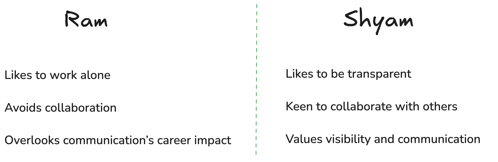
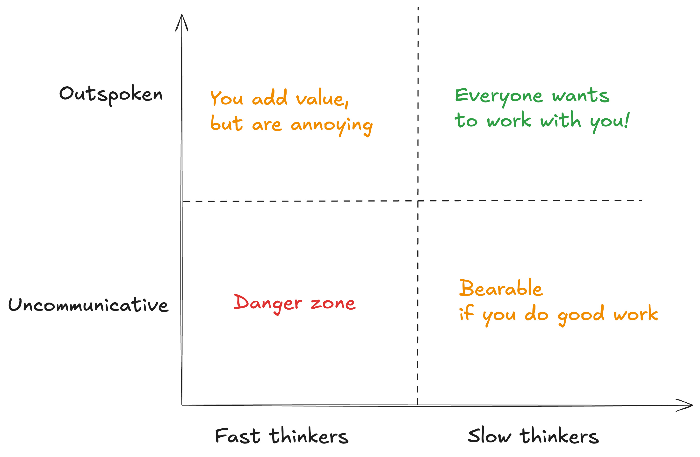

It was one of those farewell dinners we had hosted back in college. I was in the third year. I was surrounded by two junior batches and two senior batches in the same party. And being the _elected governor_ of the club, my job was to ensure that the younger ones learn and have a good time with the seniors.

On this one particular night, a lot of people were bonding, and it was amazing. But then I saw this young boy sitting in the corner by himself. Let’s call him Aditya. It was a bit dark and Aditya was trying to just get by, unnoticed. He looked overwhelmed and disinterested. I went up to him with a big smile and a lot of kindness, and said - _“Hey man, what’s up? Why don’t you approach and talk to a few here? They are friendly, you know. You like Open Source, so maybe talk to that guy (pointing to a senior of mine) and ask him how he got started.”._

His response that day still echoes in my ear. It felt like a voice coming out of a closed heart. And my words had fallen flat on him. He said, with a smirk, “_I am not an extrovert_”.

I looked into his eyes and saw the disgust for everyone in the room. Aditya was a proud introvert, as I like to call them. Little did he know that most people in that club were introverts, true nerds. They would rather sit in front of the computer than go out during the yearly college social fest. Yet, Aditya thought he is unique and does not belong there. Later that year, Aditya left the club.

I have met a lot of Adityas in life. They sit quietly in one group, but are the loudest in another. They use introversion as an excuse to not grow. What they don’t realize is - everyone is an introvert and everyone is an extrovert. It’s often an unconscious choice we make. For some, it is easy and natural, for some it takes a bit more effort.

## Be an extrovert at work

In the traditional meaning, everyone should be an extrovert at work. But there are two big challenges with this. First, people don’t know what that means. Does being an extrovert at work mean you need to shout “Good morning!” to everyone like a human alarm clock? No, but if you want to try, let me know how that works out. Does it mean I should be shouting in every single meeting? Does it mean I get to speak the most in conversations?

The second challenge is the misconception that communication should be natural and effortless. While the reality is, it takes effort to communicate and drains energy for everyone. Most speakers and developer advocates (I have been one) often enjoy the calmness when the meeting gets over. People don’t realize everyone is putting in some effort, even though it may not feel that way.

## It’s a skill, learn and practice it like a skill

Let me start by saying that work is not a social club. Everything you do at work is part of work. Talking to your colleagues about their life? It’s part of work. You are building relationships which will help you out sometime later. No matter what role you play, you will always have to communicate and collaborate with others. If this is something you disagree with, you should go back to the drawing board and think deeply.

Allow me to paint you a picture. Ram and Shyam are two senior engineers in a team. (I could have picked more modern characters, but in this world, Ram and Shyam are such classy names, how can I not pick them?!)

Ram has been writing code for five years. He likes to sit in a cave and do his work. He has often rescued the team in situations with critical bugs. However, he’s a bit shy and doesn’t like to share what he is working upon. He’d rather disappear for a week to finish the work than collaborate with others. As a result, he is less visible to his colleagues and leadership.

Shyam has also been writing code for five years. You wouldn’t call him a genius like Ram, but he asks excellent questions. Not trying to be intentionally difficult, but he likes to ensure that everyone is on the same page. He likes to break down his 5 days of work, in smaller chunks and often invites others to collaborate with him. He’s good at being transparent and delegating. Likewise, he’s always excited to do a demo and talk about his work with colleagues from different teams. As a result, he is more visible to everyone around him.

The manager likes both equally. But when the budget is tight and he or she has to promote only one of them, everyone favors Shyam _slightly_ more than Ram. Natural biases.

Ram learns about Shyam’s promotion and feels a bit disappointed. He goes back home and says to himself “_I am not an extrovert_”, consoles himself and moves on with life.

You can find these Rams and Shyams in almost every group in the world. The biggest misconception that Rams have is that they think communication skills can’t be learned.

It needs to be treated as a necessary skill. It has a direct impact on you, your family and your career. Why wouldn’t you do what brings more prosperity back home?

## Being outspoken does not mean Fast Thinking

If you haven’t heard the concept of “Fast thinking” vs “Slow thinking”, you should check out [Thinking Fast and Slow](https://www.goodreads.com/book/show/11468377-thinking-fast-and-slow). Here’s a summary anyway.

Our brains have two modes when it comes to making decisions. There is a fast part of the brain which makes most of the day-to-day decisions in an autopilot mode. For example, when brushing teeth, you don’t plan out what quadrant of the teeth you should begin with. It all just happens while you think about the delicious breakfast you’ll be having later.

Slow thinking requires significantly higher energy, but is responsible for most of the learning and high quality work that you produce. Since fast thinking requires less energy, the brain ideally wants to do everything in this mode.

This graph is mostly inspired by engineers, but it applies to any high skilled labor or someone in R&D. People like working with others who collaborate with them. But they also prefer those who think deeply when it’s needed.

While the concept of fast and slow thinking helps us understand the mental energy required for thoughtful collaboration, it also ties into another dynamic we often see - the frontbencher vibes.

## Frontbencher vibes

While the diagram above represents my subjective view of the world, I do want to address the “Outspoken” and “Fast thinker” category of people who emit the frontbencher vibes. They are the ones to always raise their hand when someone says “_does anyone have a question?_” There is a desire to learn and grow, but also a hidden desire to be _seen_. They often do not care what others think of them.

I sometimes emit frontbencher vibes myself. But there is a thin line in being a frontbencher and being an annoying human being. I usually shut up when I sense that I am being the annoying one in the room. It’s one of the most difficult social skills that I have found in life.

## Be an introvert in real life friendships

Some of you might be thinking “_This extrovert doesn’t understand what it is like to be an introvert_”. Let me disprove that. A while ago, I wrote about [BFS vs DFS in friendships](https://orkohunter.net/blog/bfs-vs-dfs-in-friendships). It’s inspired by the concepts of Breadth-first search and Depth-first search when traversing trees. Most long-lasting friendships are often two introverts talking to each other and exploring each other’s depths. As I grow older, I realize it’s rare and precious. Making friends gets harder and harder as you age.

DFS friendships are like diving deep into a conversation about life at 3 AM. BFS friendships? More like, “So, how’s the weather?” ten times over. Both have their charm.

If you read the article or know me personally, you’ll realize that I am an extrovert on camera, but an introvert in real life. I find this lifestyle fascinating. Most high-growth people I know closely are like this.

## Your mileage will vary

You can always find people who are more extroverted or introverted than you. Instead of hiding behind some sort of pride in a personality trait, you should recognize the necessary skills and learn them, especially at work. That being said, slow thinking and collaboration goes a long way.
