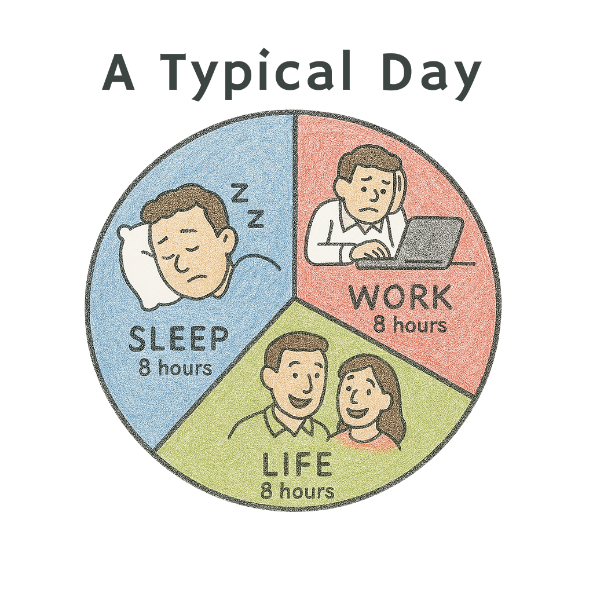

10 PM on a Sunday night. You’re back home after a night out with friends. A couple of beers and some pizza. The place was too loud but you still managed to have a conversation. Maybe about cricket, football, or some half-serious romantic interest. But some part of your brain kept reminding you that tomorrow is Monday, _again_.

On the way home, you open Zerodha or Robinhood to check up upon your stocks and mutual funds. _“Gotta keep the grind on”_, you said to yourself. After mindlessly scrolling through some reels and sending it to your friends, you fall asleep.

This is life for most tech workers today, in Bangalore, London, the Bay Area, New York or Berlin. Regular life, for most single people in their 20s. For those in 30s, add the search for a life partner and EMI stress. Everything else stays the same.

**How did we get here?** We used to be bright-eyed, curious, building things in college rooms or scribbling new ideas in our notebooks. Now we’re calendar-bound adults who feel guilty for thinking about work on a Sunday, but also feel unproductive on a Monday. Wednesdays often make us question our life decisions.

Where did that creative joy go? When did the artist in all of us _die_? Does it have to be like this for the rest of our lives?

## The 8-8-8 Rule

**“Work-life balance” is a broken phrase**. It suggests that _work_ and _life_ are two opposite forces. Like the opposite ends of a seasaw.

We forget that 8-hour shifts and time clocks were only invented a few centuries ago, to keep the factories running. In the Industrial Revolution, it made sense for the factory jobs that needed 24x7 shifts to keep the machines running. Most of those jobs, no longer exist as more and more machines are designed to operate independently with little to no supervision.

But most likely your job isn’t in a factory. And "the machines" you operate don’t need you 24x7. Most of them are built to run without you. In tech, most of the mundane, manual work is disappearing.

So why are we still obsessed with 9 to 5? And carving out a single chunk of 8 hours each day for something that doesn't feel part of life?

Some people work best at 6 AM, others can feel the flow state after sunset. Why is this not the norm? Teams can still have a few shared hours, say 10 AM to 2 PM, and leave the rest flexible. For globally distributed companies, there’s no perfect answer. Just build a truly async culture ground up but have human interactions when needed. Get together in person when it matters. Gain trust by showing ownership. Trust beats micromanagement. I have written more about this in detail in one of my previous posts called [Live Asynchronously](/blog/live-asynchronously). But this post is more than just async work.

## Extremes Exist on Both Sides

We love to call out the _workaholics_, people who sacrifice health, family, and everything else to get ahead. But let’s also talk about the other extreme, people who check out the moment the clock hits 5, talk more about their CTC and office gossip at dinners rather than the craft of building something new. They never touch a line of code or attend a conference outside work. There is no joy left in them. Their mind's in one place, heart in another.

I’ve had first-hand experiences with both the types. To be honest, I have had more meaningful relationships with the workaholics. Early in your career, you need to go all in. Experiment. Obsess. Stay up till 3 AM debugging if you want to. That’s not toxic hustle, that’s what falling in love with your craft looks like.

I remember my first few months at Spotify. I was debugging an unexpected authentication bug on a Friday. I hadn’t proven myself yet, and so I wanted to earn the team’s trust. I went deep - JWT, user identity flows - understood everything over the weekend. By Monday, I had the PR ready!

At the standup, my favorite engineer said, _“Nice work, man.”_ It meant the world to me. However, another one sort of joked - _“Well, now we all have to catch up because Himanshu has worked over the weekend.”_

For me, that weekend was more meaningful than any trip or party I could’ve gone on to. I was lit up. That’s what I want more people to feel, every once in a while. As Charles Bukowski would say, _if you are going to try, go all the way_.

## Don’t Just Work. Care About What You Build.

Yes, some people work only for money. It's okay and I get it. Especially if you’re supporting a family or coming from a tough background.

But if you have the luxury of choice, why not choose well? Pick a problem that excites you. Join a team that shares your values. Work with people who give a damn and have a taste. We all get one life.

Otherwise, you’ll keep dragging yourself through another Monday. Waiting for Friday like it’s a savior. Life is not just those two days we get after a work week, it's about each and every breath we take.

## The Future Is Smaller, Sharper, Self-Driven Teams

Startups have already chipped away at big companies. Airbnb came from Craigslist listings. Tiny pieces, turned into million dollar companies.

AI is accelerating this shift as well. Smaller teams. Sharper skills. Multi-faceted individuals. People who like what they do will replace people who just show up for tasks.

If you haven’t found what you love doing, you owe it to yourself to keep looking.

## Meaning and Balance

The rule of thumb here should be to spend most of the time in a meaningful way. As we grow older, we don't find much time. So, as you are sitting with your child, instead of scrolling through the phone, play along with them. Similarly, when at work, don't just fill hours, solve something real. Automate the boring stuff. Volunteer for the good problems, ask for them. If you can't find it, switch to a better, more interesting project. If it's not possible to do that in your current company, move on to a different one. It sounds hard, but it’s amazing to work on something you care about.

Don’t aim for **balance** between _work_ and _life_. Aim for **meaning**, both at _work_ and in _life_.
