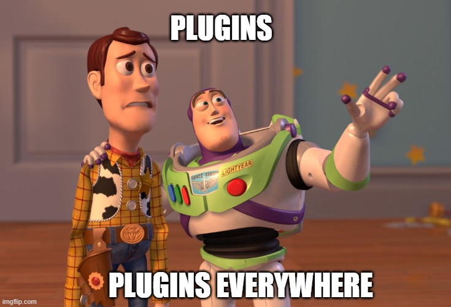

## Everything around you is a platform💡

If you are building a software to be used by developers, you can not extensability. It needs to have a way of writing extensions/plugins/apps to extend the product.

And that is true for almost all of the softwares we use. It’s true if you really think about it. Think of all the things developers use today.

Let’s start with more common examples. Smartphones and Computers. There were some good phones in 2007 but iPhone came and disrupted the market. What was so unique about it? It introduced the possibility of "writing apps for phones". And anyone could write them. We now have several billion dollar companies which are technically just apps.

If iPhone was a batteries included phone, with Apple responsible for creating all the modern apps people use, we wouldn’t be here today. Same goes for all operating systems like Linux, macOS and Windows. They are all platforms.

What’s the next thing a developer uses? Probably a browser. Even there, you can build chrome extensions, firefox plugins and what not.

Not to forget some of the most popular websites in the world like youtube, facebook, amazon, twitter, spotify, etc. are conventionally platforms.

What's next on a developer's minds? GitHub, Gitlab, etc. to host source code? You can build apps and integrations on them. It has it's own marketplace.

You use VSCode, vim, emacs etc. to write code? People have been building plugins for them for more than 30 years. They have a marketplace too.

Do you use Slack to communicate? You can build integrations and apps that run on Slack.

iTerm2 as terminal? zsh as shell? Plugins, plugins, plugins everywhere!

If you analyze your entire tech stack, you will surprised how many of them support writing plugins. From your database to your CI provider. From Kubernetes to Docker. From Figma to a Raspberry pi.

And if any of these products are open source, you can do more than just extending them. You can technically change them from their very core.

But why is that? Why did iPhones kicked the Motorola-s out of the market? Why would someone prefer a platform where they have to do extra work themselves over choosing an all-inclusive but closed product? The answer varies subjectively with people. To me, it’s the power that comes with open collaboration. You get more people building great things and sharing with each other, beyond the boundaries of a company or an org. Luckily open source has taught us similar lessons in the past 30 years.

To sum it up, there is no one-size-fits-all solution for developers. They love the unique culture in their teams and cherish them.

## Why do developers prefer Backstage over other IDP platforms?

If you don’t already know about [Backstage](https://backstage.io), it’s an open platform for building developer portals in your company. It’s an open source project incubating at CNCF.

An [internal developer portal](https://internaldeveloperplatform.org/what-is-an-internal-developer-platform/#developer-portal-service-catalog-ui-api-or-cli) is something that looks different at each company and has different use-cases. For some, it’s the developer's go-to hub for anything and everything. For some, it’s their entire catalog of the internal software ecosystem. For some, it’s their place to read and explore technical documentation. Or a place to launch new software components in the company. And many, many more such use cases.

Spotify has over 200 plugins inside their Backstage instance to enable additional use cases like A/B testing, user management, inner source, data pipelines, monitoring, deployment tracker and so on.

All these Backstage plugins inside a company are not built by their core maintainers team - it is federated and built by the experts in their domain. And it kind of makes sense. The ML/AI folks should decide and build what the rest of ML/AL engineers in the company should be using. The data folks should design the data hub and not those three full stack engineers maintaining the portal. The [Open Source marketplace](https://backstage.io/plugins) for Backstage has hundreds of plugins built by different companies.

Moreover, these plugins inside your Backstage-powered developer portal not only come from open source, but you have full power to write your own ones. Do you have an in-house way of managing users? No worries, write that plugin. Do you have an in-house way to measure software performance metrics? No worries, write that plugin.

After all, Backstage is your developer portal. Why not bend it to fit your existing engineering culture, rather than changing your culture to fit how a software works.
