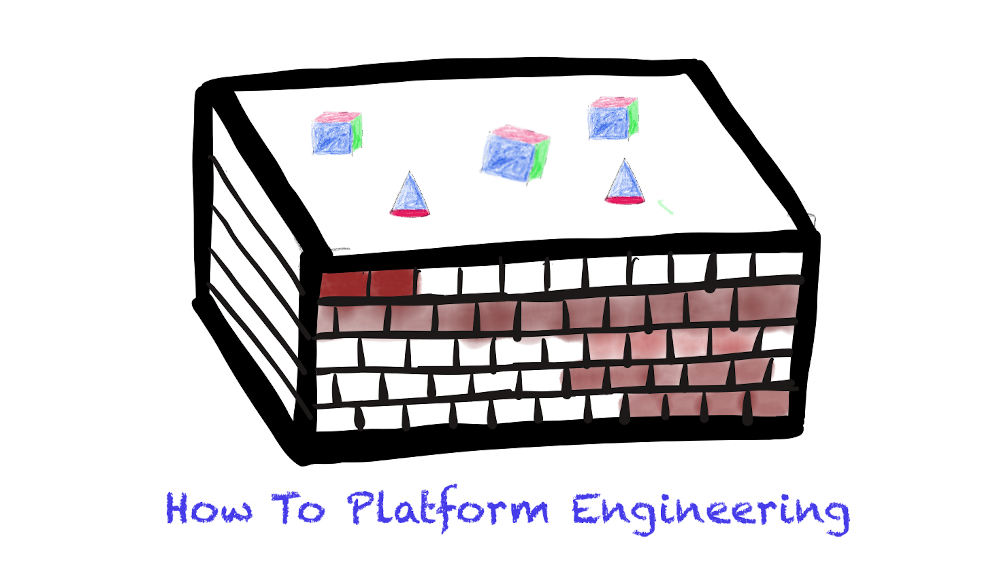

I remember the day I heard the word **microservices** for the first time. For a while, I did not know what it truly meant. But it was a very hot topic, popping up in every conference and on everyone's slides.

This was 2015, Kubernetes had just been open sourced. Several companies had taken a leap of faith and started their year-long migrations, ditching SRE-managed monolithic server farms and adopting cloud native architectures. Most of the [early adopters](https://thinkinsights.net/strategy/crossing-the-chasm/) had already made this move by the time I got to be an insider at Twitter, Spotify and Mercari.

Correlation of Microservice and Kubernetes. Source: Google Trends

However the seeds of this trend were planted long before in the history of software development.

## The Bezos Mandate: Origin of microservices

One day in 2002, Jeff Bezos sent out a [mandate](https://gist.github.com/chitchcock/1281611) to all the teams. It was a visionary yet strong idea to force all the internal services to communicate with each other via APIs. They were to assume that all services can be externalized in near future. This directive shattered traditional silos within the organization and emphasized treating both internal and external customers with equal importance.

This seemingly simple shift in mindset laid the foundation for a monumental transformation that was yet to come. Four years later in 2006, Amazon launched AWS and shaped the cloud as we know today.

Bezos mandate about microservice architecture

This revolutionary platform allowed anyone to access computing resources like task queuing systems, server instances and storage, previously reserved for tech giants. This democratization of computing power unleashed unprecedented opportunities for startups, enterprises, and individuals to innovate without the burden of hefty upfront investments.

## The Kubernetes Revolution: Shaping the Cloud-Native Landscape

As cloud computing gained momentum, the need for efficient orchestration and management of applications across diverse environments became evident. Enter Kubernetes, an open-source container orchestration platform initially developed by Google. Kubernetes provided the tools to deploy, scale, and manage applications seamlessly, regardless of the underlying infrastructure. Its rise marked a shift towards cloud-native technologies and microservices-based architectures.

Image source: https://thenewstack.io/the-rise-of-the-cloud-native-cloud

## The Growing Burden on Developers

While these advancements brought unforseen agility for the teams, they also introduced new challenges. Developers, once focused primarily on coding, now find themselves responsible for the entire software delivery lifecycle end-to-end. From designing and developing to deploying, scaling, and maintaining applications, their role expanded significantly. This transition demanded a solution that could streamline these intricate processes and enable developers to concentrate on what they do best—innovating.

## Enter Platform Engineering: Empowering Developer Productivity

Recognizing the need to alleviate the growing complexity faced by developers, the concept of platform engineering emerged. Platform engineering entails creating an internal developer platform—a set of internal (and external) tools, services, and best practices that simplify the end-to-end software development process. This platform equips developers with the resources they need to build, test, deploy, and manage applications efficiently, while abstracting away much of the underlying infrastructure complexity.

By providing a standardized environment, automation capabilities, and reusable components, platform engineering empowers developers to focus on coding and business logic rather than grappling with deployment intricacies or operational concerns.

## What's next?

Further in this series, I will explore

- A brief history of Backstage, another CNCF project among the ranks of Kubernetes and cloud native technologies.
- What is an "Internal Developer Portal" and how it is the backbone of any platform org in a company.
- Current state of developer portals and the use-cases
- Future of Platform engineering

Join me in discussing this revolutionary phase of elevating Developer Experience!
