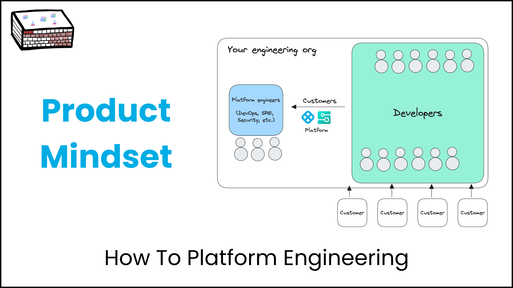

## Treat Your Developers Like VIP Customers

Your developers are not just users; they're customers who have high expectations from your internal developer platform. Comprising a blend of in-house and third-party tools, this platform is essential for your developers to deliver top-notch software products. The takeaway? Treat your internal platform like a product, not just a service. Let's dive into the "how" and "why."

## Product Managers are Crucial to Platform Engineering

What Happens When You Think Like a Product Manager?

- You solve real problems your developers face.
- You actively collect and listen to feedback.
- You define KPIs and keep an eye on adoption rates.
- You forge meaningful relationships to enhance the developer experience.

Sound familiar? Companies with excellent engineering cultures are already doing this. If you’re not, it’s high time to start.

**Actionable Tip**: Consider hiring a Product Manager focused solely on "Developer Effectiveness." This role could be a game-changer for both new and experienced engineers.

Key responsibilities that you should expect from this role

- Deep understanding of the engineering culture
- Gathering feedback from developers
- Building action oriented roadmap of your platform
- Directly responsible for platform tools like Internal Developer Portal
- Building consensus among platform providers on best practices and tools of choice
- Create Golden Paths for new joiners

## Internal Customer Advisory Board: A new paradigm

The platform org at Spotify runs a Customer Advisory Board (CAB) every year for their internal customers i.e. developers. This is a day when all platform product managers and stakeholders gather in front of dozens of developers and allow them to yell about their problems. Well not exactly but you get the idea. It results in murals of problems and ideas which they take back to platform engineers who implement them. I was one of them. :)
Not every company runs a CAB for their external customers. Doing it for internal platform users is a sign of how strong of an engineering culture you have.

**In a great organization, both internal and external customers are almost indistinguishable**. Just like [Mr Bezos had mandated](https://www.linkedin.com/pulse/brief-history-platform-engineering-himanshu-mishra/) in early 2000s for Amazon.

## KPIs and Metrics: The Navigational Tools for Success

Three Ways to Measure Platform Health

1. Formal feedback via surveys and in-app mechanisms
2. Informal feedback loops with platform engineers and product managers
3. Data-driven approaches, like DORA metrics and tools like Software Engineering Insights

**Actionable Tip**: Conduct a biannual developer survey to identify bottlenecks and rate overall satisfaction.
Ask them to rate their experience with internal tools and overall satisfaction with the internal platform. Ask them how easy it is for them to find information internally like services, APIs and documentation. Ask them where they spend their most time being blocked on other people or processes.

## Hackathons: Your R&D Lab for Developer Experience

Hackathons are not just coding marathons; they're your innovation playground. Encourage engineers to ideate and create; you'll be surprised at the brilliant internal tools and solutions that emerge. After all your customers are hackers who take pride in solving problems.

## Quick Wins: Practical Steps for Applying the Product Mindset

1. Staff Up: Hire roles that focus on Developer Effectiveness.
2. Identify Pain Points: What slows down your developers?
3. Implement Feedback Loops: Consider setting up a Customer Advisory Board or dedicated channels.
4. Set KPIs: Metrics to measure adoption and success are crucial.
5. Organize Hackdays: Let your developers be the problem-solvers they naturally are.

## Conclusion: Your Next Steps

If you're an engineering leader wondering where to begin, start by evaluating your current state with an [engineering assessment](https://assessment.harness.io/assessment/invite). The road to a better platform and a satisfied developer community starts with adopting a product mindset.

Thank you for reading. Let me know your thoughts in comments and what would you like to read next.
