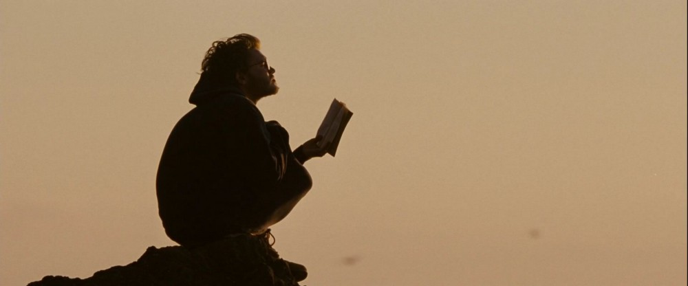

You may listen to this while reading [We Are All Astronauts - Ether (YouTube)](https://www.youtube.com/watch?v=-fFbeSykaJk).

<iframe width="600" height="400" src="http://www.youtube.com/embed/-fFbeSykaJk" frameborder="0" allowfullscreen></iframe>

 

Few months ago, a significant percentage of my peers were involved in the process of getting a job or an internship, including me. Some got the _success_ while some are still trying. But to my astonishment, I found that the degree of comfort in each one of them was not as expected. What I mean by that is, not everyone who got this success was happy, and not everyone who failed was sad, although the majority was skewed on the side of the former case.

As I broadened my perspective and timeframe, I found that getting a job which pays in money, is not something which can give satisfaction to every human being. We cannot universally advise this to everyone. If you think so, then please understand the gravity of human population on this planet, and my concern was about satisfaction which is difficult to define, since a large part of it loses touch with materialism.

So, I aligned my line of thought with **_loving the work we do_**. If a farmer spends the day on their field, and they enjoy it, then it’s good, isn’t it? How about the software engineer who thinks their technology can help people or maybe due to some other reason, they find love in the code, they write? I found that it was closer to being a ubiquitous activity which can keep people happy, or at least a large number of humans. But then, I saw people who do not have any job at first place. By _job_, I mean an activity which benefits people and provides something (_e.g. salary_) in return for the individual. But there are wanderers, _fakirs_, hitchhikers and many types of _unemployed_ people. So, are they different from _regular_? These people challenged the universality of this line of thought.

It further gave me an idea that instead of (or along with) loving the work, we also need to **_enjoy with the peers who surround us_**. So, a lot of human beings are embraced by their parents, friends and/or children. It does not happen always, but we can still find some of these in different bandwidths of our life. It reminded me of the letter by Richard Feynman, [Do not remain nameless to yourself](https://fs.blog/2014/08/richard-feynman-what-problems-to-solve). So yeah, Living in love can be a universal thing to do. And it allowed me to picture this massive population of ours on the planet earth. But then, I found exceptions. I thought of Chris McCandless ([_Into the wild_](https://en.wikipedia.org/wiki/Into_the_Wild_%28film%29)) and how he did not find love in his family but Nature.

I was back to square one. Do we need another human being to live this life, happily? People can not always surround us. And further, outside of seven billion humans, there are other lives as well. What about dogs, or the trees, plants, and flowers which are alive? Or a lost animal somewhere in the jungle. Do they have to have a peer to share the love or their _pursuit of happiness_?

My problem set got bigger, and I appreciated _how difficult it must be for a democracy to form its constitution_ or King Hammurabi to write his [code](https://en.wikipedia.org/wiki/Code_of_Hammurabi). At this point, I felt a little exhausted in finding the answer to my question (it had been several months by now).

But a few days ago, as I was practicing [Vipassana Meditation](https://en.wikipedia.org/wiki/Vipassan%C4%81#Vipassana-meditation_in_the_modern_Vipassana_movement), I had an epiphany about the question. I realized how much did I miss to observe about my own physical body even when there was so much going on already. I never noticed my breath on its whole (trust me, when I say, I still have not). The moment we start to breathe in, and it goes on for a full length, and then it stops. A moment of no activity, and then we breathe out. And the cycle repeats. Breathing is just one of the many involuntary signs of life, and yet it goes on unnoticed. It made me regard the totality around me, even more. To mention a few, the breeze which blows past me when I stroll on [2.2](https://wiki.metakgp.org/w/2.2), the distant sound I listen to while typing this text, the leaves which fall off from the trees when I sit with a cup of _chai_ at [Bhaski’s](https://www.google.co.in/maps/place/Bhaski%27s/@22.3161081,87.2988514,21z/data=!4m5!3m4!1s0x3a1d43feddbb1c35:0xeff718f07e02348!8m2!3d22.3159891!4d87.2987071), and other many signs of life.

I think, for the question of _“What is something which should be the universal action of everyone?”_, I can put it in words as “_To witness”_. We necessarily do not have to think, question, or react to the activities around us or _even inside us_, but to just witness the presence of life. In Sanskrit, we call this state of no-mind as निर्विचार. I felt that generally, we are ignorant of ourselves and we miss to observe a lot. With this awareness and focus, the decisions we make are quite apparent, and we can then work on optimizing our limited time on this planet to do something.
